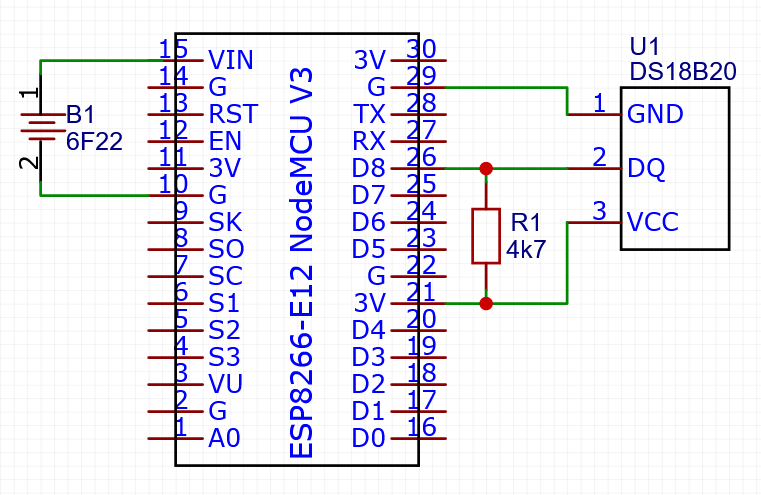
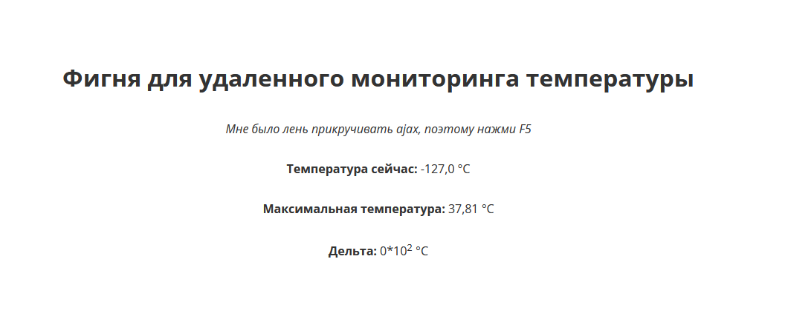

<h1>Online thermometer</h1>


<p><b>Simple thermometer on ESP8266 (NodeMCU V3) with web interface</b></p>

<h2>🛠 Hardware</h2>
<p>To build the device, you will need a NodeMCU V3 microcontroller (or analogues), a DS18B20 thermal sensor, a 4.7k resistor. Connect according to this scheme:</p>
<p align="center"></p>
<p>Instead of 6F22, you can connect any other DC source with a voltage of 3.7-20 V</p>

## 💻 Software
In the file `main.ino` set SSID and password of your access point in which network the web interface should be available:
```c++
#define SSID "your ssid" 
#define PASS "your password"
```
Also if you connect the DS18B20 to other pin, change this value:
```c++
#define DS_PIN D8
```
After that, you can connect NodeMCU to your computer and upload the firmware.

## 🎯 Using
Open the serial monitor with 9600 baud rate and copy the local address of the web interface. It usually looks like `192.168.1.104`. Then open this in your browser. If everything is ok, you will see something in the likeness:

<p align="center"></p>

The current temperature, the maximum temperature and the difference between the last two changes are displayed here. If the sensor is not connected (as in this example), a value of -127 °C will be output.

The page is updated automatically every 10 seconds. The solution is terrible, but I was too lazy to screw AJAX.

## 🤝 Contributing
If you have any ideas or found any bugs here, plz open the [issue](https://github.com/dan-sazonov/wifi-temp/issues)
 or make a fork and offer a [pull request](https://github.com/dan-sazonov/wifi-temp/pulls). And it will be
 great if you tell me about these ideas, maybe I'm already working on them.
 
## 👨‍💻 Author
The author of this repository and code - [@dan-sazonov](https://github.com/dan-sazonov). <br>
**Reach me:**<br>
[✈️ Telegram](https://t.me/dan_sazonov) <br>
[📧 Email](mailto:p-294803@yandex.com) <br>
